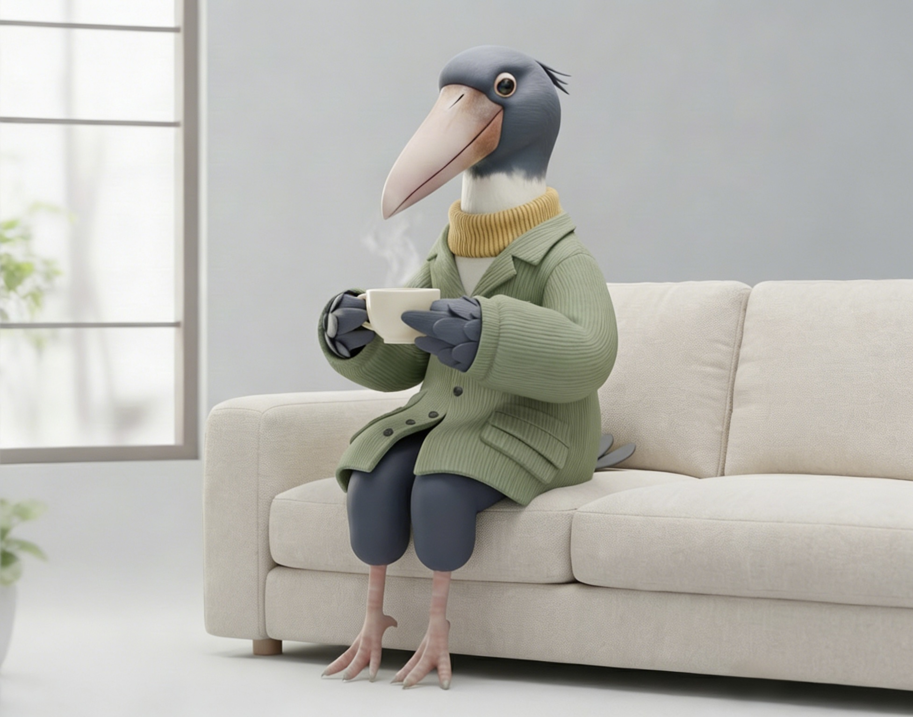

## Hi there 👋
# 🏝️ Welcome to Zaizai Isle

  

  
  

> **Build more, think more, find the spark.** > **再做一点，再想一点，惊喜总在发生。**

### 🏝️ Zaizai Isle | Personal Sanctuary

<b>Build more, think more, find the spark.</b>

<b>再做一点，再想一点，惊喜总在发生。</b>

---

### 🧭 Navigation / 导览

| [🌐 Visit the Isle / 访问小岛](https://zaizai-isle.github.io) | [📬 Get in Touch / 联系我](mailto:zaizaiely@gmail.com) | [📁 Projects / 全部项目](https://www.google.com/search?q=https://github.com/zaizai-isle%3Ftab%3Drepositories) |
| --- | --- | --- |

---

### 🦉 Design Philosophy / 设计笔记

> *“在数字潮汐中，寻找那块不动的礁石。”*

#### 01. The Spirit / 灵感：鲸头鹳

全站设计以**鲸头鹳**为图腾。它代表了 AI 时代稀缺的特质：**极致的静止、深度的观察**。这种“禅意”构成了小岛的底色——外在波澜不惊，内在逻辑精密。

#### 02. The Visual / 视觉风格

追求**“极致清冷”**的呼吸感。通过大量的留白（Negative Space）与低饱和色调，过滤掉互联网的嘈杂，只留下纯粹的思考内容。

#### 03. The Interaction / 核心交互

动效遵循**“延迟反馈”**逻辑：*“再多停留一秒，惊喜才会发生。”* 这种设计旨在奖赏那些像鲸头鹳一样拥有耐心的探索者。

---

<b>🌍 English Version / 英文版介绍 (Click to Expand)</b>

**Zaizai Isle** is a digital sanctuary where design meets logic.

**01. Inspiration:** Inspired by the Shoebill, representing stillness and focus in the AI era.

**02. Aesthetics:** A "Clean & Cold" visual style focused on breathability and silence.

**03. Interaction:** Designed with the philosophy that subtle persistence leads to unexpected "sparks."

---

### ✉️ Reach the Isle

<i>“Stay still, stay curious.”</i>

—— <b>Zaizai</b> 🏝️

