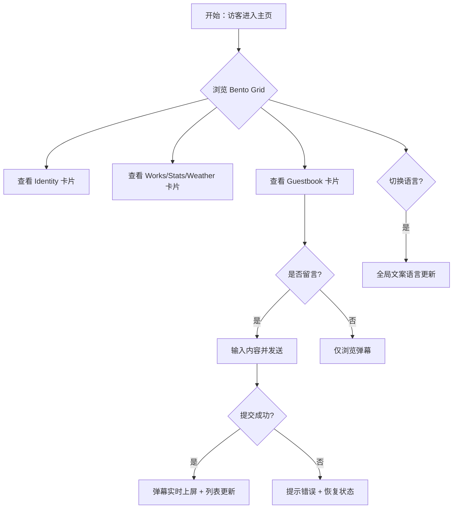

# 产品需求文档：All about 个人主页 - V1.0

## 1. 综述 (Overview)

### 1.1 项目背景与核心问题
用户需要一个展示个人身份、技能、作品和社交互动的在线主页。当前通过 "All about" 项目，以 Bento Grid（便当盒布局）风格呈现，旨在提供一个视觉美观、交互丰富且支持多语言的个人展示平台。核心目标是让访问者快速了解“我是谁”、“我做了什么”，并能通过留言板进行互动。

### 1.2 核心业务流程 / 用户旅程地图
1.  **阶段一：初次访问与印象建立** - 访客进入主页，通过 Identity Card（身份卡片）建立第一印象（姓名、Slogan、动态背景）。
2.  **阶段二：内容浏览与探索** - 访客浏览作品集 (Works)、GitHub 统计 (Stats)、天气 (Weather) 等卡片，了解博主背景。
3.  **阶段三：互动与反馈** - 访客在留言板 (Guestbook) 查看他人留言（弹幕效果）并发送自己的留言。
4.  **阶段四：个性化体验** - 访客切换语言（中/英）或调整背景设置（如有），获得更舒适的浏览体验。

### 1.3 Mermaid 图（流程/状态/时序）

#### 1.3.1 用户操作流


## 2. 用户故事详述 (User Stories)

### 阶段一：初次访问与印象建立

---

#### **US-01: 个人身份展示 (Identity Card)**
*   **价值陈述 (Value Statement)**:
    *   **作为** 访客
    *   **我希望** 一进页面就能看到博主的头像、姓名和个性签名
    *   **以便于** 快速确认这是谁的主页以及他的核心主张
*   **业务规则与逻辑 (Business Logic)**:
    1.  **前置条件**: 页面加载完成。
    2.  **展示内容**: 头像 (90x90px 圆形)、姓名 (Bold)、身份标签 (Product Designer 等)、Slogan (支持多语言)。
    3.  **视觉效果**: 背景需包含动态的“玻璃云朵”和“闪光”效果；Slogan 支持鼠标悬停的扫光特效。
    4.  **多语言**: 切换语言时，Slogan 内容和字体样式（英文斜体）需同步更新。
*   **验收标准 (Acceptance Criteria)**:
    *   **场景1: 默认展示**
        *   **GIVEN** 访客进入主页
        *   **WHEN** 页面加载完毕
        *   **THEN** Identity 卡片显示在左上角（通常位置），背景有云朵动画，Slogan 清晰可见。
    *   **场景2: 语言切换**
        *   **GIVEN** 当前为中文
        *   **WHEN** 点击切换为英文
        *   **THEN** Slogan 变为 "A bit more building...", 且应用斜体样式。

---

### 阶段三：互动与反馈

---

#### **US-02: 留言板互动 (Guestbook Card)**
*   **价值陈述 (Value Statement)**:
    *   **作为** 访客
    *   **我希望** 能看到其他人的留言并发布自己的祝福
    *   **以便于** 表达对博主的喜爱并产生连接
*   **业务规则与逻辑 (Business Logic)**:
    1.  **弹幕展示**: 历史留言以“弹幕”形式在卡片背景中从右向左滚动；支持 Framer Motion 动画。
    2.  **留言提交**: 输入框非空时允许提交；支持“乐观更新” (Optimistic UI)，即点击发送后立即显示在界面上，随后异步写入数据库。
    3.  **数据同步**: 使用 Supabase 实时订阅 (Realtime Subscription) 功能，他人新发的留言应自动出现在屏幕上。
    4.  **异常处理**: 若写入数据库失败，回滚界面上的乐观更新并提示错误。
*   **验收标准 (Acceptance Criteria)**:
    *   **场景1: 发送留言**
        *   **GIVEN** 输入框有内容 "Hello World"
        *   **WHEN** 点击发送按钮
        *   **THEN** 留言立即出现在列表中/弹幕中，输入框清空。
    *   **场景2: 接收实时留言**
        *   **GIVEN** 用户A停留在页面
        *   **WHEN** 用户B在另一台设备发送留言
        *   **THEN** 用户A的屏幕上自动出现新留言弹幕。

---

### 阶段四：个性化体验

---

#### **US-03: 多语言切换 (Language Switcher)**
*   **价值陈述 (Value Statement)**:
    *   **作为** 国际访客
    *   **我希望** 能将界面语言切换为英文
    *   **以便于** 无障碍阅读内容
*   **业务规则与逻辑 (Business Logic)**:
    1.  **状态管理**: 使用 React Context 全局管理语言状态 (zh/en)。
    2.  **持久化**: (可选) 记住用户的语言偏好。
    3.  **覆盖范围**: 所有卡片标题、Slogan、占位符文案均需支持替换。
*   **验收标准 (Acceptance Criteria)**:
    *   **场景1: 切换英文**
        *   **GIVEN** 当前是中文
        *   **WHEN** 点击语言切换按钮
        *   **THEN** 页面所有文本瞬间变为英文。

---

*   **页面布局线框图 (ASCII Wireframe)**:
    ```text
    +-------------------------------------------------------+
    |  [ Identity Card (2x2)       ]  [ Works Card (1x1) ]  |
    |  Avatar | Name | Slogan      |  Project A Link        |
    |  (Cloud Animation BG)        |                        |
    |                              +------------------------+
    |                              |  [ Stats/Github (1x1)] |
    |                              |  Commits / Stars       |
    +------------------------------+------------------------+
    |  [ Guestbook Card (2x1)      ]  [ Weather Card (1x1)] |
    |  Running Danmaku Messages    |  Location / Temp       |
    |  [Input] [Send]              |                        |
    +-------------------------------------------------------+
    ```
